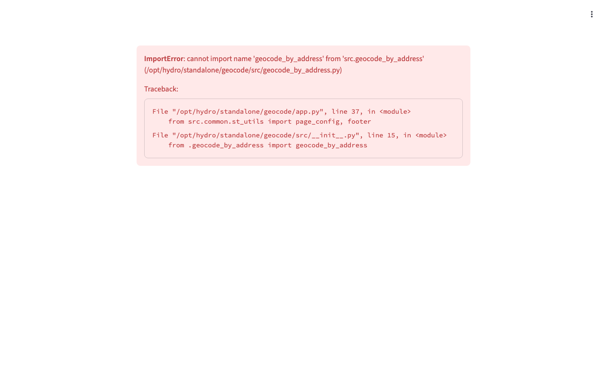

# 📍 地理编码工具

[English](README.md) | **中文**

[](https://github.com/zengtianli/hydro-geocode)
[](LICENSE)
[](https://python.org)
[](https://streamlit.io)
[](https://hydro-geocode.tianlizeng.cloud)

批量地理编码工具 — 基于高德地图 API，地址与坐标互转。



## 功能特点

- **逆地理编码** — 经纬度坐标转详细地址
- **正向地理编码** — 地址转经纬度坐标
- **企业搜索** — 按企业名称 POI 搜索定位
- **WGS-84 ↔ GCJ-02 转换** — 自动坐标系变换
- **批量处理** — 上传 Excel/CSV，一次处理数百条记录
- **内置示例数据** — 打开即用，零门槛体验

## 快速开始

```bash
git clone https://github.com/zengtianli/hydro-geocode.git
cd hydro-geocode
pip install -r requirements.txt
export AMAP_API_KEY="your_key_here"
streamlit run app.py
```

## 命令行用法

```bash
# 逆地理编码
python run.py reverse input.xlsx output.xlsx --gcj02

# 正向地理编码
python run.py address input.xlsx output.xlsx

# 企业搜索
python run.py company input.xlsx output.xlsx
```

## 部署（VPS）

```bash
git clone https://github.com/zengtianli/hydro-geocode.git
cd hydro-geocode
pip install -r requirements.txt
export AMAP_API_KEY="your_key_here"
nohup streamlit run app.py --server.port 8517 --server.headless true &
```

## Hydro Toolkit 插件

本项目是 [Hydro Toolkit](https://github.com/zengtianli/hydro-toolkit) 的插件，也可独立运行。在 Toolkit 的插件管理页面粘贴本仓库 URL 即可安装。也可以直接**[在线体验](https://hydro-geocode.tianlizeng.cloud)**，无需安装。

## 许可证

MIT
